## Tech Stack

* **React (JavaScript)** – Component-based UI development
* **Vite** – Lightning-fast development server & bundler
* **React Router DOM** – Client-side routing
* **Tailwind CSS** – Utility-first styling
* **JSON Server** – Local mock backend & REST API
* **React Toastify** – Toast notifications

## Installation

### Step 1: Clone the Repository

```bash
git clone https://github.com/Hardik0602/management-app
cd management-app
```

### Step 2: Install Dependencies

```bash
npm install
```

### Step 3: Start the Local Backend

```bash
npm run server
```

### Step 4: Start the Development Server

```bash
npm run dev
```

## Dependencies

```json
{
  "@tailwindcss/vite": "^4.1.18",
  "json-server": "^1.0.0-beta.3",
  "react": "^19.2.0",
  "react-dom": "^19.2.0",
  "react-router-dom": "^7.11.0",
  "react-toastify": "^11.0.5",
  "tailwindcss": "^4.1.18"
}
```

## Screenshots

### Login

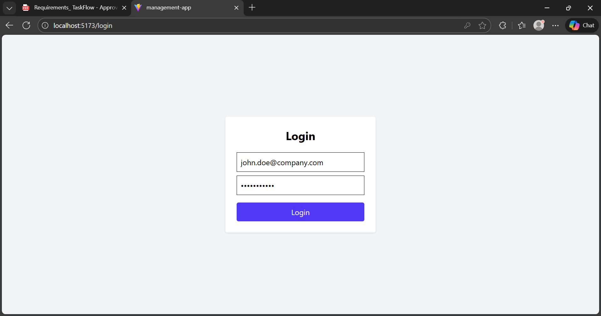
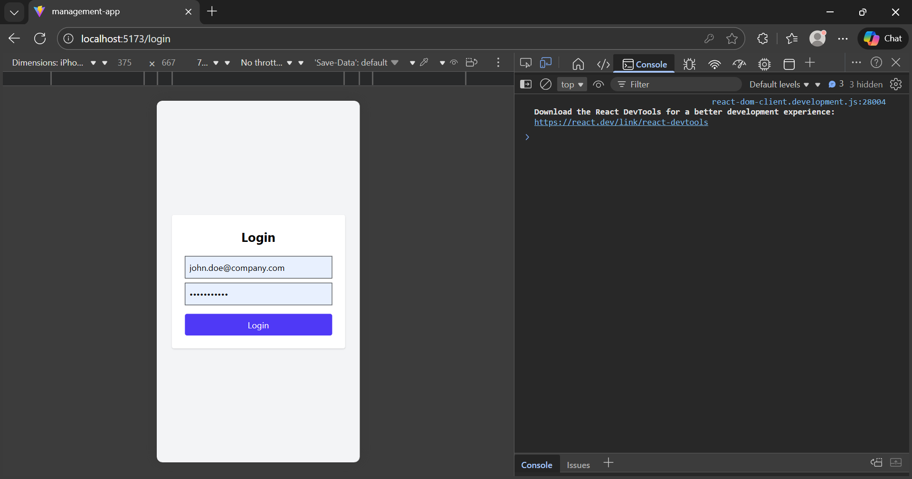

### Inbox

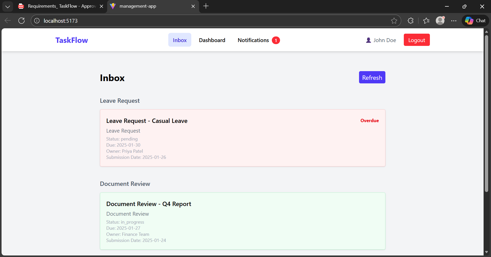
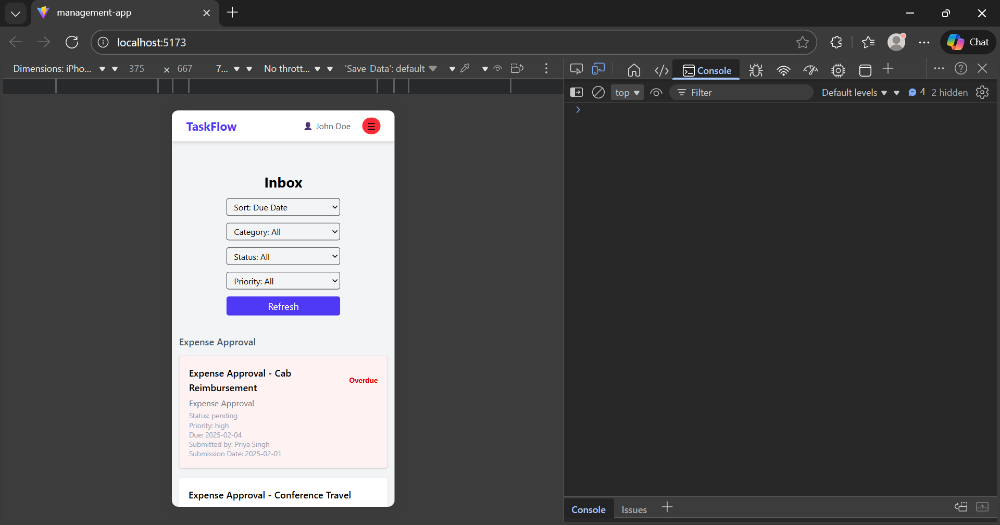

### Dashboard

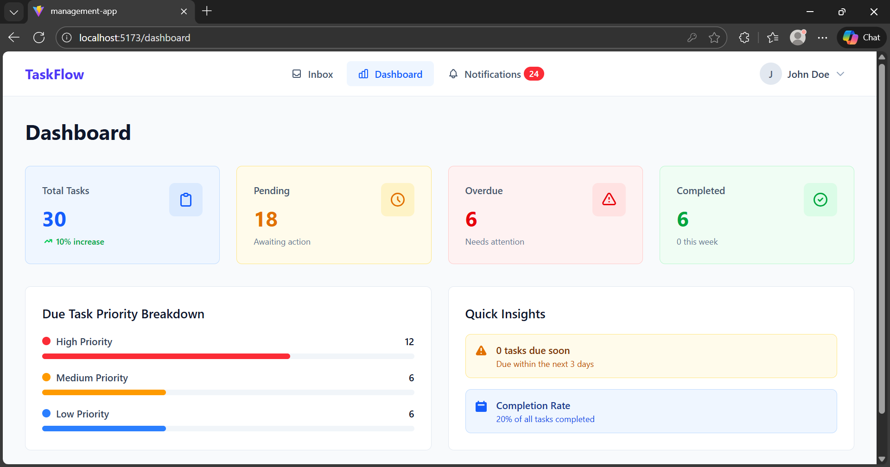
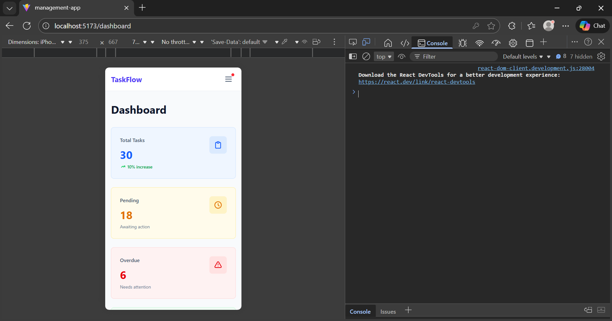

### Notifications

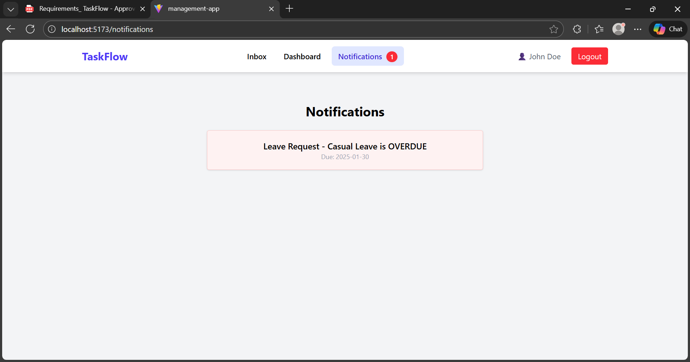


### Task


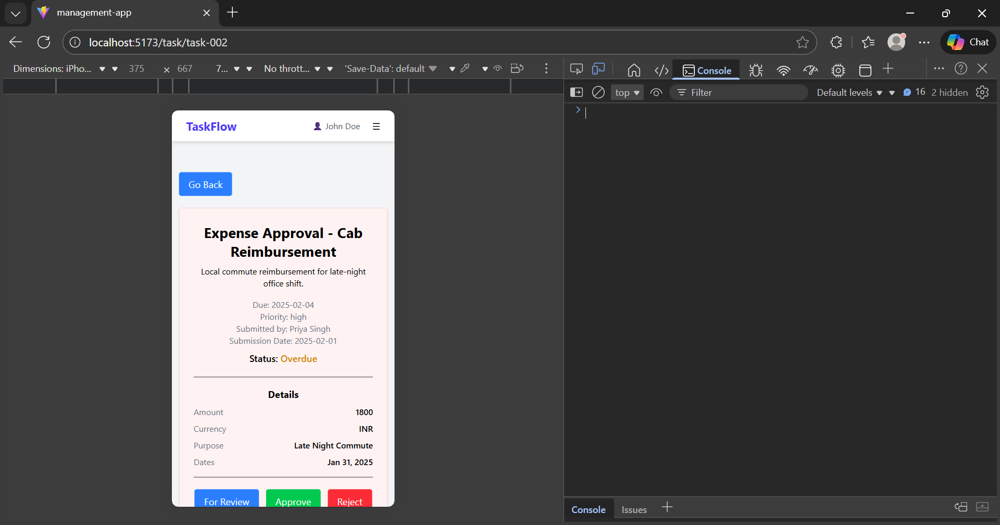

### Confirm Action

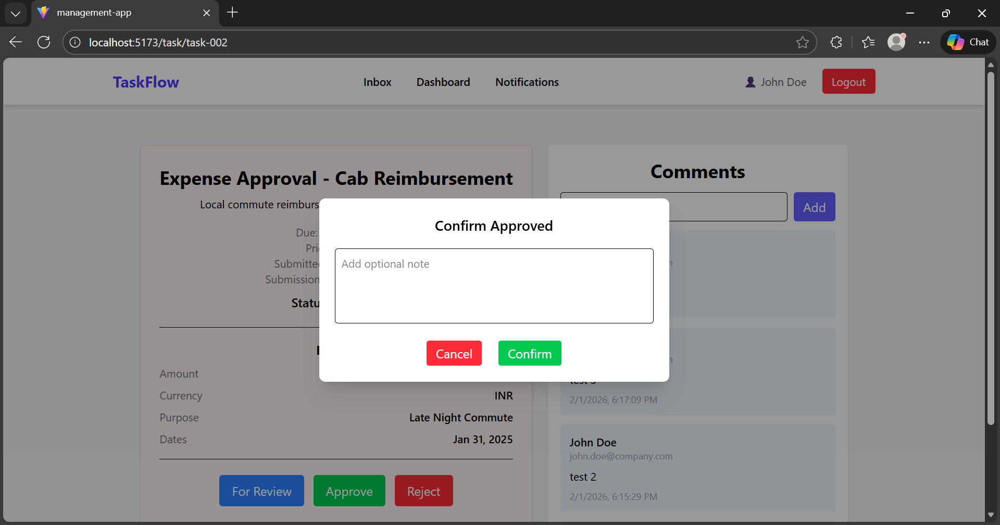
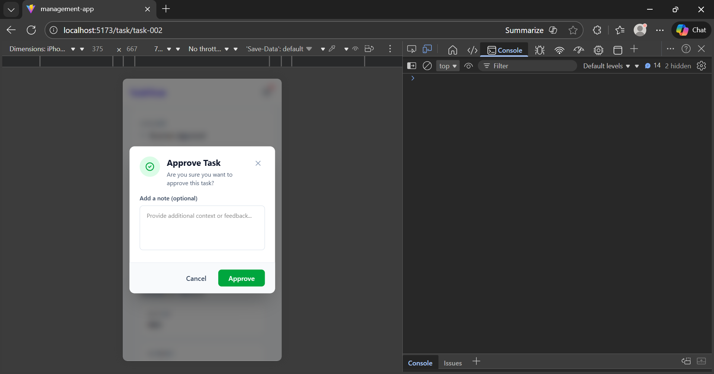

### Profile

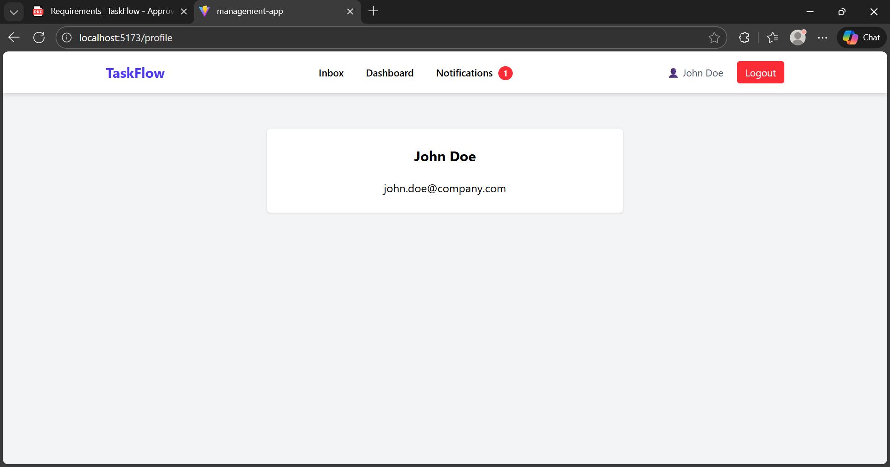
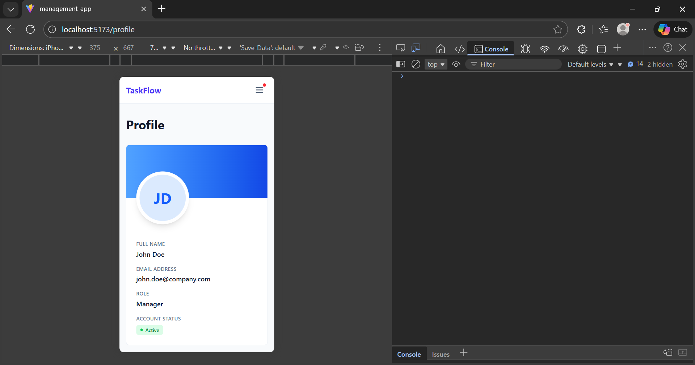